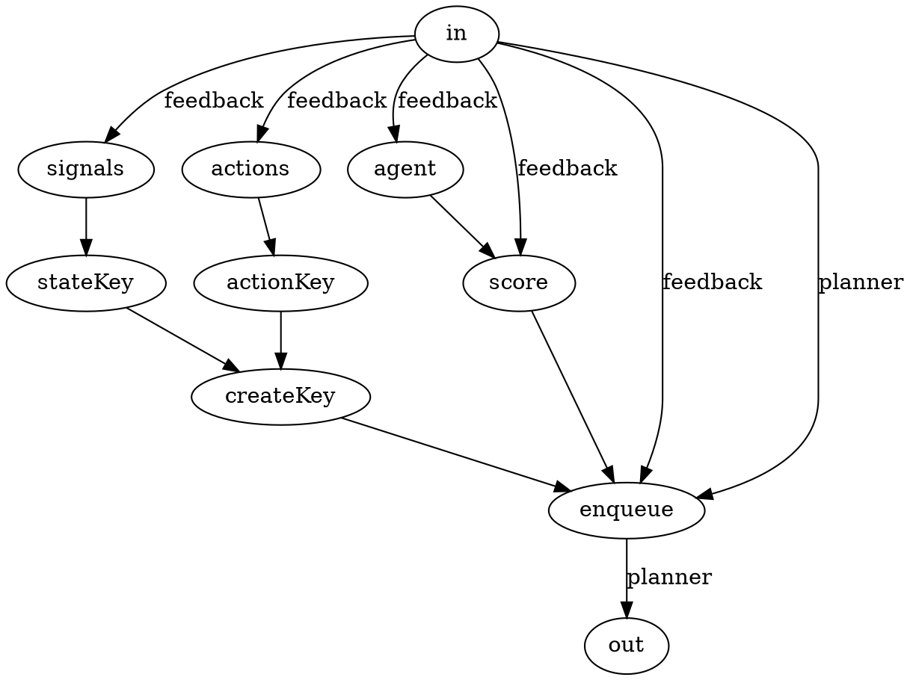
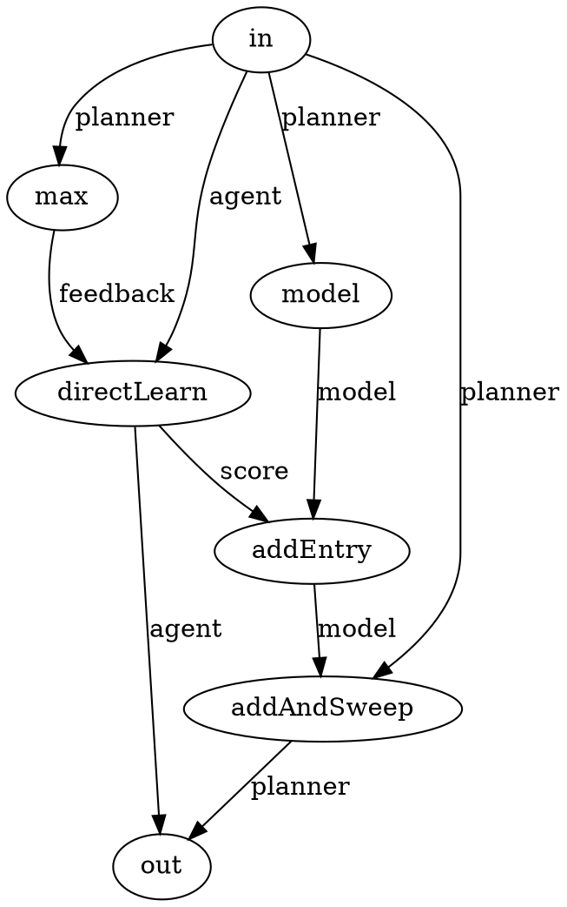
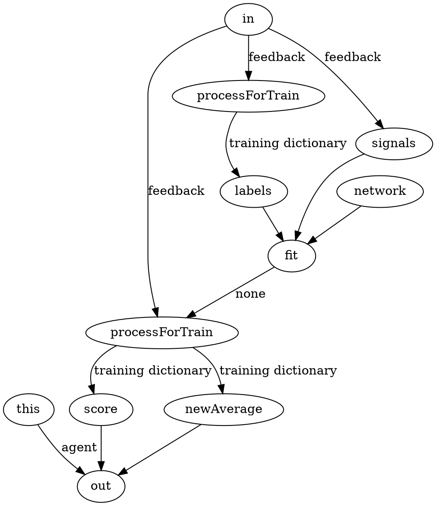
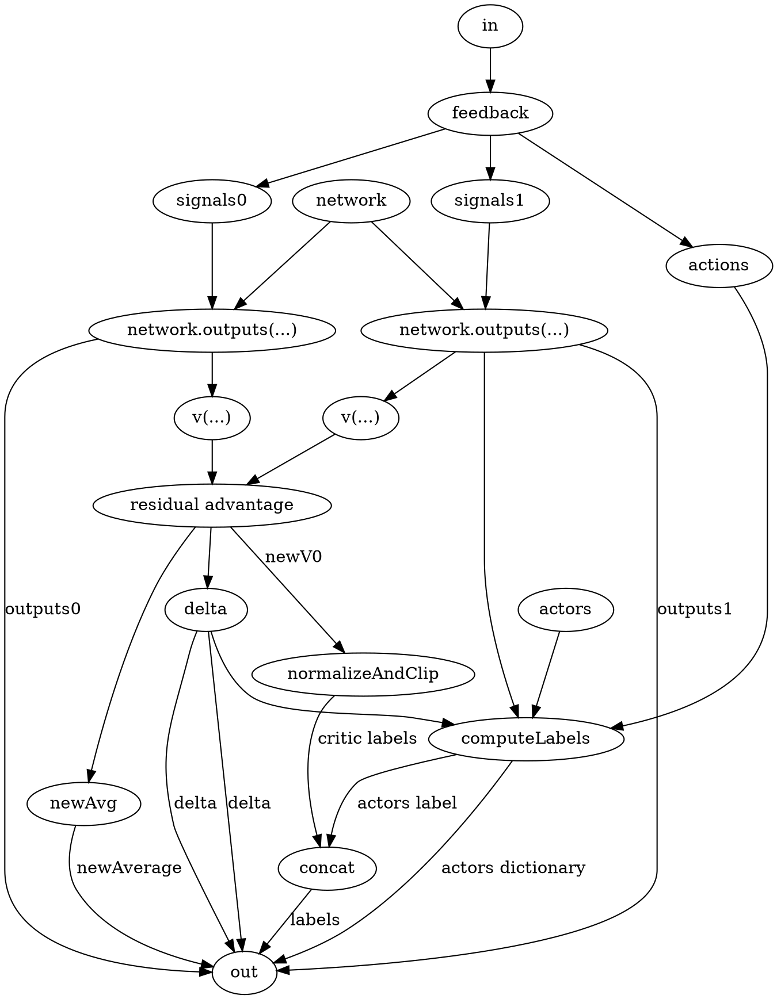

PlannerLearn

```dot
digraph PlannerLearn {
    in -> signals [label=feedback]
    in -> actions [label=feedback]
    signals -> stateKey
    actions -> actionKey
    stateKey -> createKey
    actionKey -> createKey
    in -> agent [label=feedback]
    agent -> score
    in -> score [label=feedback]
    createKey -> enqueue
    score -> enqueue
    in -> enqueue [label=feedback]
    in -> enqueue [label=planner]
    enqueue -> out [label=planner]
}
```

Planner plan

```dot
digraph plannerLoop {
  in -> max [label="planner"]
  in -> directLearn [label="agent"]
  max -> directLearn [label="feedback"]
  directLearn -> addEntry [label="score"]
  in -> model [label="planner"]
  model -> addEntry [label="model"]
  addEntry -> addAndSweep [label="model"]
  in -> addAndSweep [label="planner"]
  addAndSweep -> out [label="planner"]
  directLearn -> out [label="agent"]
}
```

Agent directLearn

```dot
digraph plannerLoop {
    processForTrain1 [label="processForTrain"]
    in -> processForTrain [label=feedback]
    in -> signals [label=feedback]
    processForTrain->labels [label="training dictionary"]

    network -> fit
    signals -> fit
    labels -> fit
    fit -> processForTrain1 [label=none]
    in -> processForTrain1 [label=feedback]
    this -> out [label=agent]
    processForTrain1 -> score [label="training dictionary"]
    processForTrain1 -> newAverage [label="training dictionary"]
    newAverage -> out
    score -> out
}
```

Agent processForTrain

```dot
digraph plannerLoop {
    ra [label="residual advantage"]
    outputs0 [label="network.outputs(...)"]
    outputs1 [label="network.outputs(...)"]
    v0 [label="v(...)"]
    v1 [label="v(...)"]

    in->feedback
    feedback->signals0
    feedback->signals1
    feedback->actions

    signals0 -> outputs0
    network -> outputs0
    outputs0 -> v0
    
    signals1 -> outputs1
    network -> outputs1
    outputs1 -> v1

    v0 -> ra
    v1 -> ra

    ra -> normalizeAndClip [label=newV0]
    ra -> delta
    ra -> newAvg
    
    outputs1 -> computeLabels
    actions-> computeLabels
    delta ->  computeLabels
    actors -> computeLabels

    normalizeAndClip -> concat [label="critic labels"]
    computeLabels -> concat [label="actors label"]

    computeLabels -> out [label="actors dictionary"]
    concat -> out [label="labels"]
    outputs0 -> out [label="outputs0"]
    outputs1 -> out [label="outputs1"]
    delta -> out [label="delta"]
    delta -> out [label="delta"]
    newAvg-> out [label="newAverage"]
}
```
