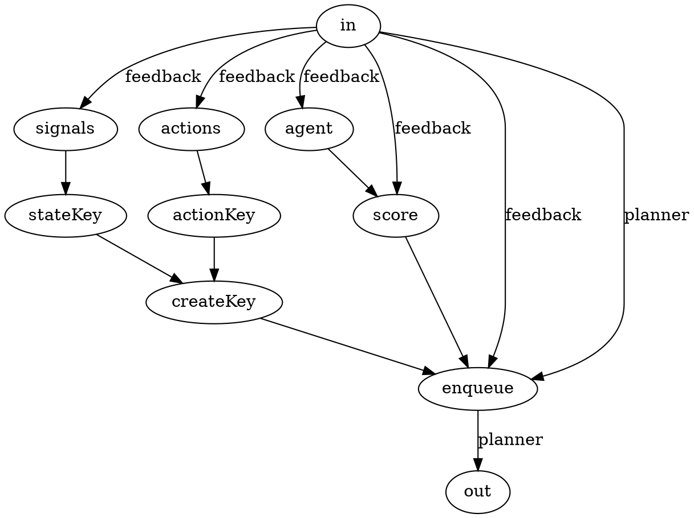
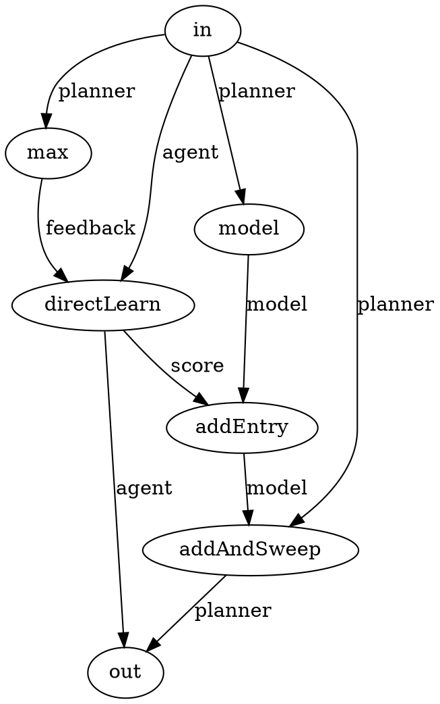

PlannerLearn

```dot
digraph PlannerLearn {
    in -> signals [label=feedback]
    in -> actions [label=feedback]
    signals -> stateKey
    actions -> actionKey
    stateKey -> createKey
    actionKey -> createKey
    in -> agent [label=feedback]
    agent -> score
    in -> score [label=feedback]
    createKey -> enqueue
    score -> enqueue
    in -> enqueue [label=feedback]
    in -> enqueue [label=planner]
    enqueue -> out [label=planner]
}
```

Planner plan

```dot
digraph plannerLoop {
  in -> max [label="planner"]
  in -> directLearn [label="agent"]
  max -> directLearn [label="feedback"]
  directLearn -> addEntry [label="score"]
  in -> model [label="planner"]
  model -> addEntry [label="model"]
  addEntry -> addAndSweep [label="model"]
  in -> addAndSweep [label="planner"]
  addAndSweep -> out [label="planner"]
  directLearn -> out [label="agent"]
}
```
