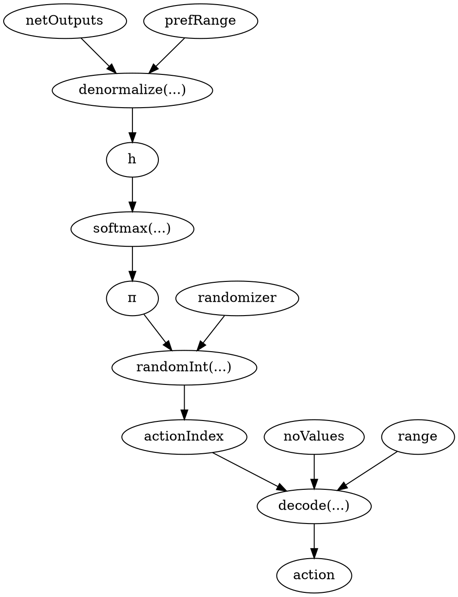
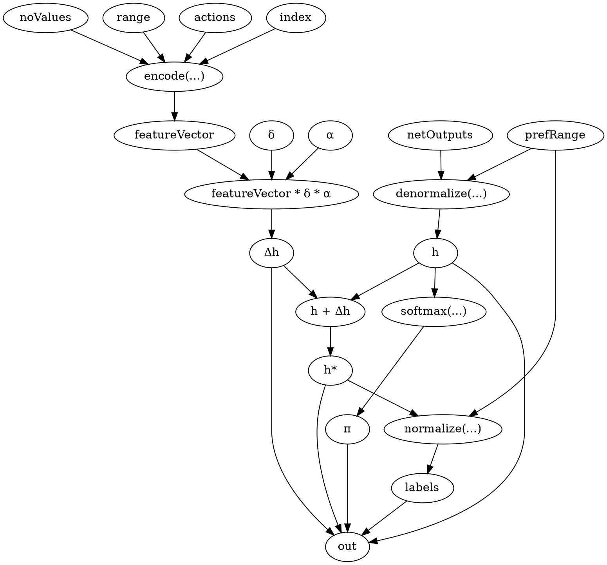
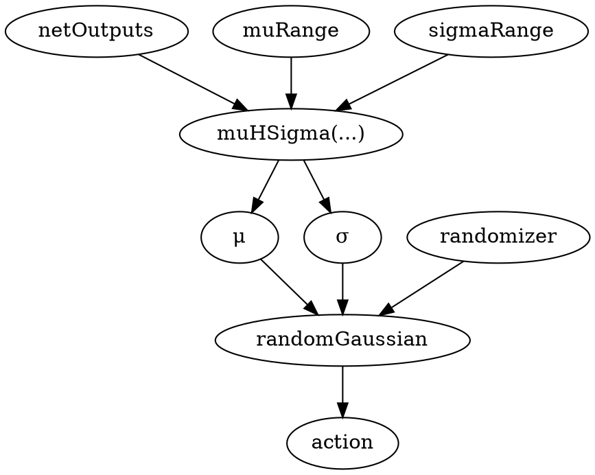
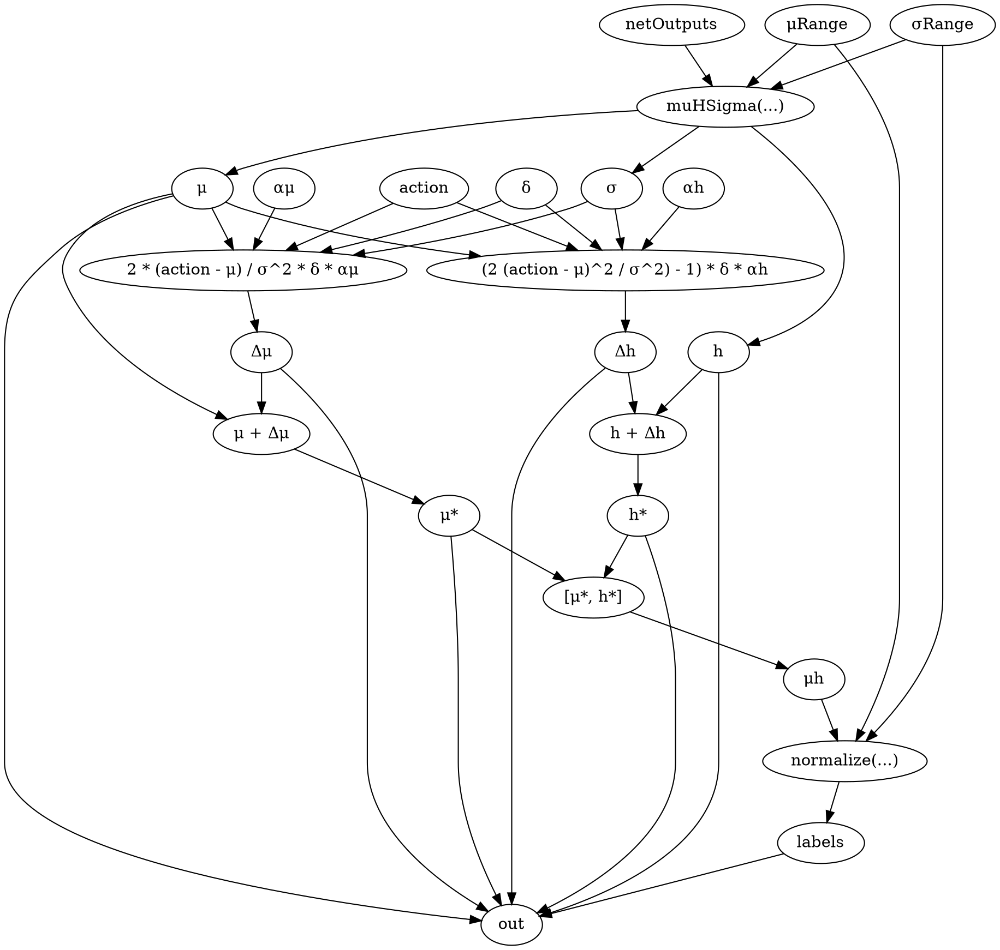
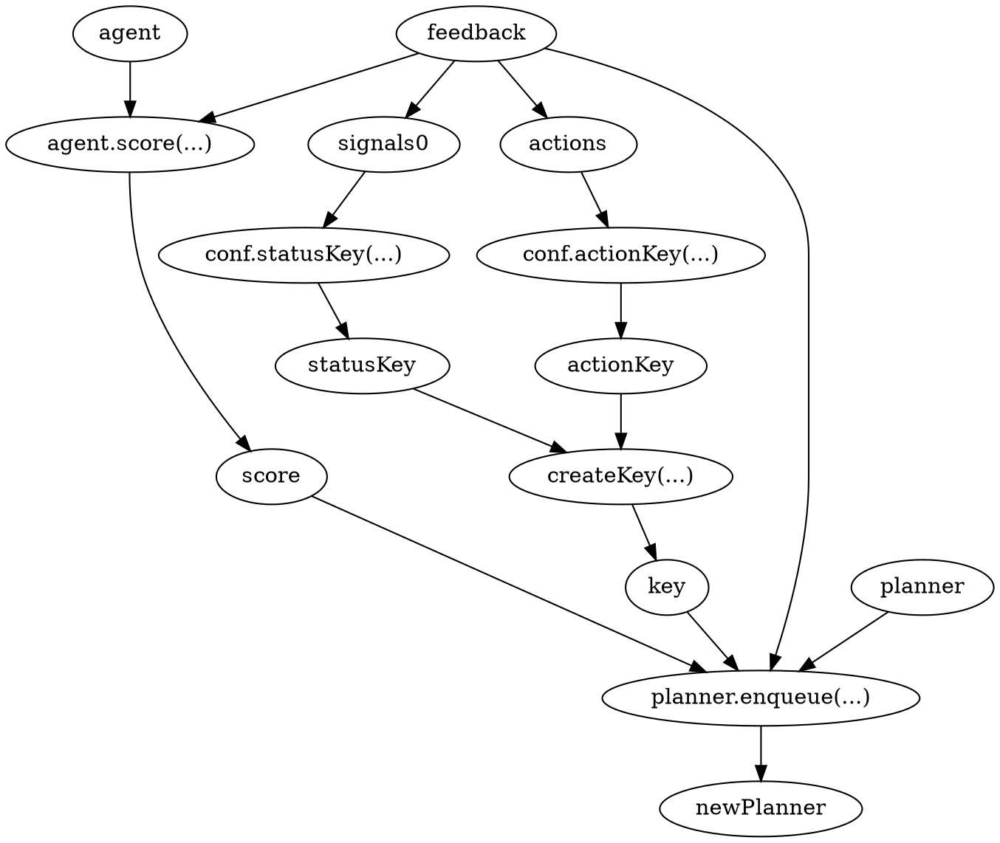
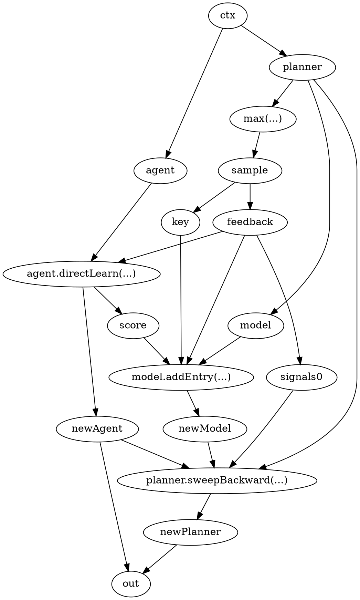
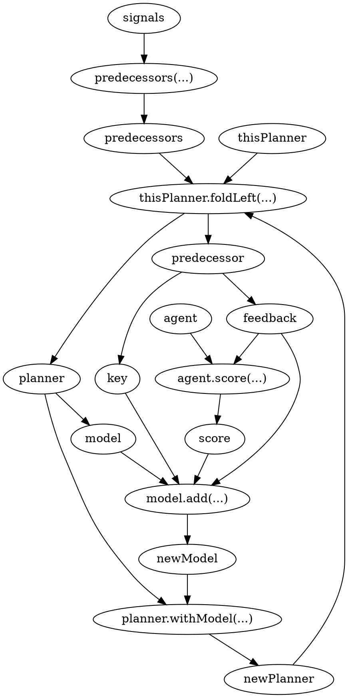
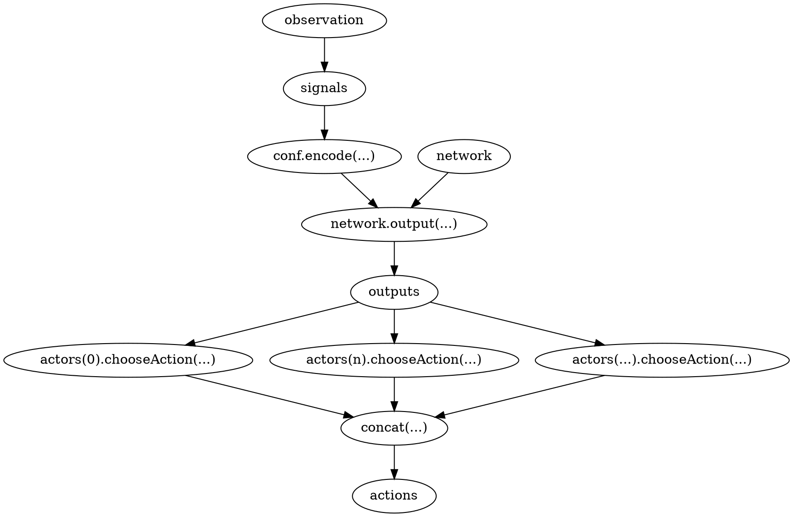
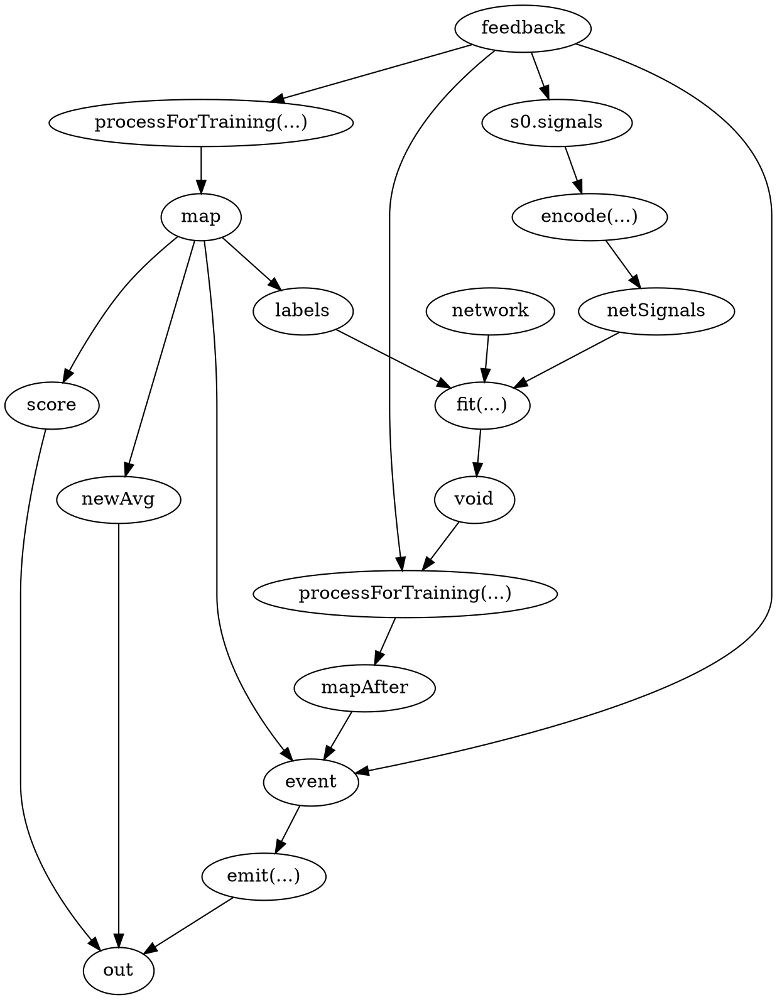
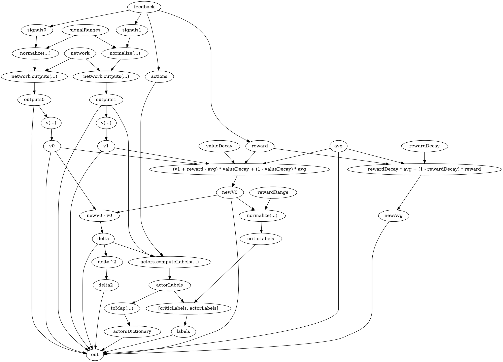

## PolicyActor.chooseAction

```scala
def chooseAction(outputs: Array[INDArray], random: Random): INDArray
```


---

## PolicyActor.computeLabels

```scala
def computeLabels(outputs: Array[INDArray],
                  actions: INDArray,
                  delta: INDArray): Map[String, Any]
```


---

## GaussianActor.chooseAction

```scala
def chooseAction(outputs: Array[INDArray], random: Random): INDArray
```


---

## GaussianActor.computeLabels

```scala
def computeLabels(outputs: Array[INDArray],
                             actions: INDArray,
                             delta: INDArray): Map[String, Any]

```


---

## PriorityPlanner.learn

```scala
def learn(feedback: Feedback, agent: Agent): Planner
```


---

## PriorityPlanner.planLoop

```scala
def planLoop(ctx: (Agent, PriorityPlanner[KS, KA]), n: Int): (Agent, PriorityPlanner[KS, KA])
```


---

## PriorityPlanner.sweepBackward

```scala
def sweepBackward(signals: INDArray, agent: Agent): PriorityPlanner[KS, KA]
```


---

## ActorCriticAgent.chooseAction

```scala
def chooseAction(observation: Observation, random: Random): INDArray
```



---

## ActorCriticAgent.directLearn

def Agent.directLearn(feedback: Feedback, random: Random): (Agent, INDArray, INDArray)


---

## ActorCriticAgent.processForTrain

 def Agent.processForTrain(feedback: Feedback): Map[String, Any]


