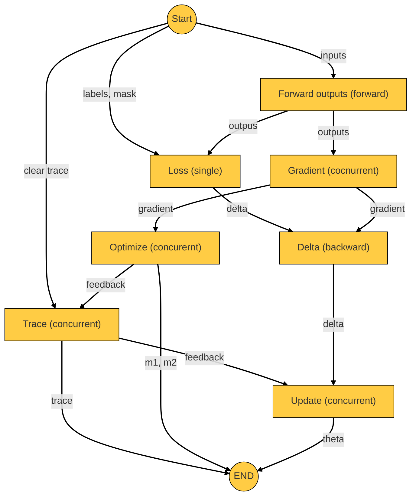

# Neural Network Specifications

[TOC]

## Stories

### Create network

- I can create a network architecture from scratch
- So that I can create the network

### Save network architecture

- I can save the network architecture
- so that I can later load from file

### Load network architecture

- I can load a network architecture from file
- So that I can create the network

### Build network

- I can build the network from network architecture
- So that I can use it to compute outputs or learn from samples

### Create network data

- I can create network data
- So that I can feed the network

### Save network data

- I can save network data to a file
- so that I can ater load from file

### Load network data

- I can load network data from a file
- So that I can feed the network

## Details

### Network

To build a network I must

- must define the number of input nodes
- must define the output loss function (MSE, *MSLE)
- must define the parameters initializer random, xavier
- must define the type of optimization (sgd($\alpha$), adam($\alpha, \beta_1, \beta_2, \varepsilon$))
- can define the type of contraints (gradient limits(min, max))
- can define the type of trace mode (none, addition, *replacing)($\lambda, \gamma$ )
- can define the type of regularization (l1, l2($\lambda$))
- must define the hidden layers

### Hidden layer

To build a hidden layer I

- must define the type of layer
- can define the learning hyper parameters depending on the type of layer

### Activation Layer

To build an activation layer I

- must define the activation function (tanh, *sigmoid, *relu, *hardtanh)

### Dense Layer

To build a dense layer I do not neet 

- must define the number of output nodes

## Learning process concurrency

Each node rappresente the process activity and between brackets if the activity is forward/backward sequenced throw layers or concurrent updated or in a single layer

